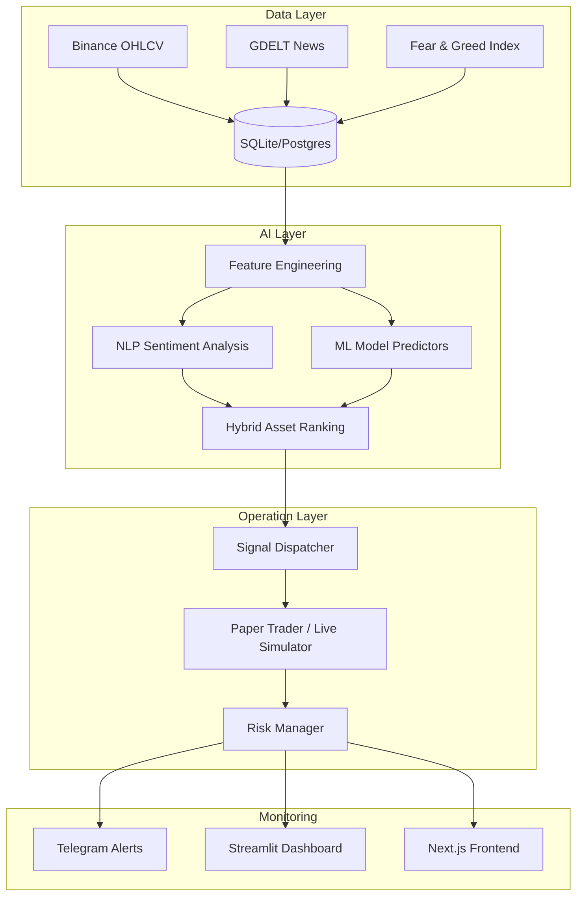

# 🚀 AlphaScope: Modular Quantitative Trading Intelligence

<p align="center">
  <a href="README.md">Português 🇧🇷</a> | <b>English 🇺🇸</b>
</p>

---

## 🇺🇸 About the Project


**AlphaScope** is a modular quantitative platform built for the cryptocurrency market. The system automates the entire trading lifecycle: from massive data ingestion (Binance, GDELT, Fear & Greed) to Paper Trading execution monitored by Machine Learning and NLP models.

### 🎯 The Purpose
The main goal of AlphaScope is to democratize **Professional Quantitative Trading**.
- **Emotionless Trading:** Decisions based on data and hybrid scoring.
- **24/7 Automation:** A runtime engine (Daemon) that keeps the system running uninterrupted.
- **Market Intelligence:** Real-time news processing using Natural Language Processing (NLP).

---

## 🏗️ System Architecture



---

## 🛠️ Technologies
- **Languages:** Python 3.10+ (Core), Go (Services), Rust (Performance).
- **Data:** SQLite (Dev), PostgreSQL (Prod), DuckDB (Research).
- **AI/ML:** Scikit-Learn, NLP Scoring, Optuna (Auto-ML).
- **Interface:** FastAPI (API), Next.js (Frontend), Streamlit (Dashboard).

---

## 🚀 Quick Start

### 1. Installation
```powershell
# Clone the repo
git clone https://github.com/OtavioHG/alphascope.git
cd alphascope

# Virtual Environment
python -m venv venv
.\venv\Scripts\Activate.ps1
python -m pip install -r requirements.txt
python -m pip install -e .
```

### 2. Validate Setup
```powershell
python -m alphascope.cli doctor
```

---

## 💻 Main Commands

| Command | Description |
| :--- | :--- |
| `ingest-market` | Collect historical data from Binance. |
| `build-features` | Process technical indicators (RSI, MA, etc). |
| `rank-assets` | Generate AI-based asset ranking. |
| `paper-trade` | Start real-time simulated trading. |
| `run-continuous` | Keep the system running in infinite cycles. |
| `runtime-status` | Check system health and Daemon status. |

---

## 📈 Roadmap & Future
1. **Live Execution:** Integrate real exchange orders via CCXT.
2. **Meta-Learning:** AI that learns from its own trading history.
3. **Advanced UI:** Full Next.js dashboard integration.

---

## ⚠️ Disclaimer
This software is for educational and research purposes. Crypto trading involves high risk. We are not responsible for financial losses.

---
⭐ **If you like this project, give it a Star!**
