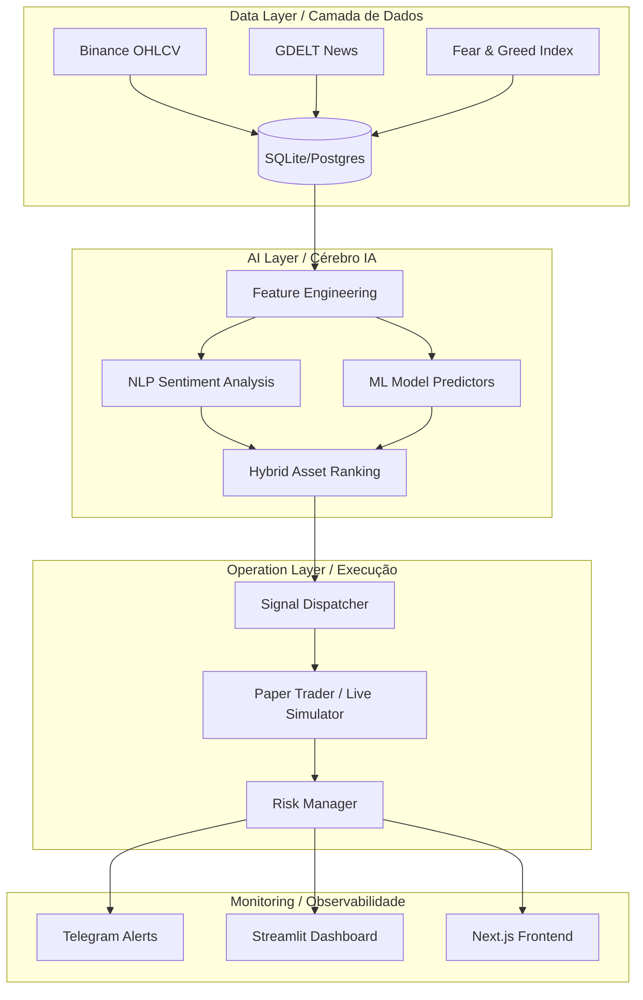

# 🚀 AlphaScope: Modular Quantitative Trading Intelligence

<p align="center">
  <a href="#-sobre-o-projeto">Português 🇧🇷</a> | 
  <a href="#-about-the-project">English 🇺🇸</a>
</p>

---

## 🇧🇷 Sobre o Projeto


**AlphaScope** é uma plataforma quantitativa modular desenvolvida para o mercado de criptomoedas. O sistema automatiza todo o ciclo de vida do trading: desde a ingestão massiva de dados (Binance, GDELT, Fear & Greed) até a execução de Paper Trading monitorada por modelos de Machine Learning e NLP.

### 🎯 O Propósito
O objetivo principal do AlphaScope é democratizar o **Trading Quantitativo Profissional**. 
- **Trading sem Emoção:** Decisões baseadas em dados e scoring híbrido.
- **Automação 24/7:** Um motor de runtime (Daemon) que mantém o sistema operando ininterruptamente.
- **Inteligência de Mercado:** Processamento de notícias em tempo real (NLP).

---

## 🇺🇸 About the Project

**AlphaScope** is a modular quantitative platform built for the cryptocurrency market. The system automates the entire trading lifecycle: from massive data ingestion (Binance, GDELT, Fear & Greed) to Paper Trading execution monitored by Machine Learning and NLP models.

### 🎯 The Purpose
The main goal of AlphaScope is to democratize **Professional Quantitative Trading**.
- **Emotionless Trading:** Decisions based on data and hybrid scoring.
- **24/7 Automation:** A runtime engine (Daemon) that keeps the system running uninterrupted.
- **Market Intelligence:** Real-time news processing using Natural Language Processing.

---

## 🏗️ Architecture / Arquitetura



---

## 🛠️ Technologies / Tecnologias
- **Languages:** Python 3.10+ (Core), Go (Services), Rust (Performance).
- **Data:** SQLite, PostgreSQL, DuckDB.
- **AI/ML:** Scikit-Learn, NLP Scoring, Optuna (Auto-ML).
- **Interface:** FastAPI, Next.js, Streamlit.

---

## 🚀 Quick Start / Como Iniciar

### 1. Setup / Instalação
```powershell
# Clone the repo
git clone https://github.com/OtavioHG/alphascope.git
cd alphascope

# Environment / Ambiente
python -m venv venv
.\venv\Scripts\Activate.ps1
python -m pip install -r requirements.txt
python -m pip install -e .
```

### 2. Validate / Validar
```powershell
python -m alphascope.cli doctor
```

---

## 💻 Main Commands / Comandos Principais

| Command | English Description | Descrição em Português |
| :--- | :--- | :--- |
| `ingest-market` | Collect historical data from Binance. | Coleta dados históricos da Binance. |
| `build-features` | Process technical indicators. | Processa indicadores técnicos. |
| `rank-assets` | Generate AI-based asset ranking. | Gera o ranking de ativos via IA. |
| `paper-trade` | Start real-time simulated trading. | Inicia o trading simulado em tempo real. |
| `runtime-status` | Check system health and Daemon. | Verifica a saúde do sistema e do Daemon. |

---

## 📈 Roadmap & Future
1. **Live Execution:** Integrate real exchange orders via CCXT.
2. **Meta-Learning:** Self-evolving AI models based on trade performance.
3. **Advanced UI:** Complete Next.js dashboard integration.

---

## ⚠️ Disclaimer / Aviso Legal
This software is for educational and research purposes. Crypto trading involves high risk. / Este software é para fins educacionais. O trading de cripto envolve alto risco.

---
⭐ **If you like this project, give it a Star! / Se gostou do projeto, dê uma estrela!**
