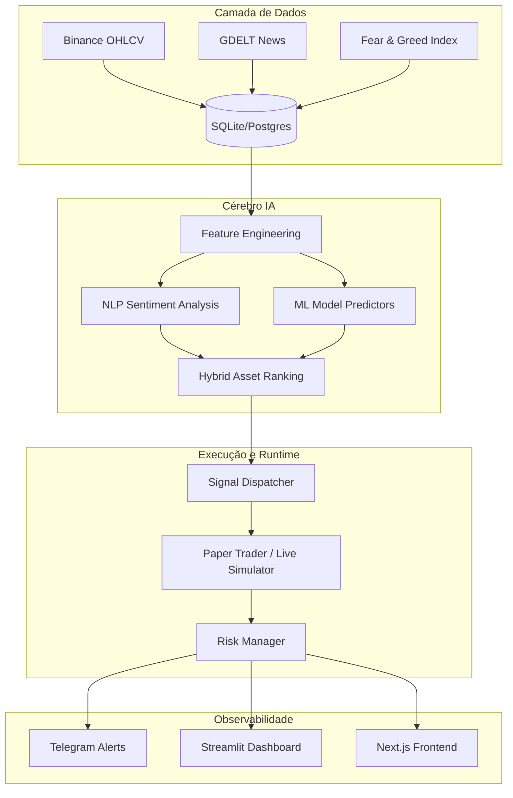

# 🚀 AlphaScope: Inteligência Modular para Trading Quantitativo

<p align="center">
  <b>Português 🇧🇷</b> | <a href="README.en.md">English 🇺🇸</a>
</p>

---

## 🇧🇷 Sobre o Projeto


**AlphaScope** é uma plataforma quantitativa modular desenvolvida para o mercado de criptomoedas. O sistema automatiza todo o ciclo de vida do trading: desde a ingestão massiva de dados (Binance, GDELT, Fear & Greed) até a execução de Paper Trading monitorada por modelos de Machine Learning e NLP.

### 🎯 O Propósito
O objetivo principal do AlphaScope é democratizar o **Trading Quantitativo Profissional**. 
- **Trading sem Emoção:** Decisões baseadas em dados e scoring híbrido.
- **Automação 24/7:** Um motor de runtime (Daemon) que mantém o sistema operando ininterruptamente.
- **Inteligência de Mercado:** Processamento de notícias em tempo real para capturar o sentimento do mercado antes que ele se reflita nos preços.

---

## 🏗️ Arquitetura do Sistema



---

## 🛠️ Tecnologias Utilizadas
- **Linguagem:** Python 3.10+ (Core), Go (Serviços), Rust (Performance).
- **Dados:** SQLite (Dev), PostgreSQL (Produção), DuckDB (Pesquisa).
- **IA/ML:** Scikit-Learn, NLP Scoring, Optuna (Auto-ML).
- **Interface:** FastAPI (API), Next.js (Frontend), Streamlit (Dashboard).

---

## 🚀 Como Iniciar

### 1. Instalação
```powershell
# Clone o repositório
git clone https://github.com/OtavioHG/alphascope.git
cd alphascope

# Ambiente Virtual
python -m venv venv
.\venv\Scripts\Activate.ps1
python -m pip install -r requirements.txt
python -m pip install -e .
```

### 2. Validar Ambiente
```powershell
python -m alphascope.cli doctor
```

---

## 💻 Comandos Principais

| Comando | Descrição |
| :--- | :--- |
| `ingest-market` | Coleta dados históricos da Binance. |
| `build-features` | Processa indicadores técnicos (RSI, Médias, etc). |
| `rank-assets` | Gera o ranking de ativos baseado no modelo de IA. |
| `paper-trade` | Inicia o trading simulado em tempo real. |
| `run-continuous` | Mantém o sistema rodando em ciclos infinitos. |
| `runtime-status` | Verifica a saúde do sistema e do Daemon. |

---

## 📈 Roadmap & Futuro
1. **Execução Real:** Integração com exchanges via CCXT.
2. **Meta-Learning:** IA que aprende com o próprio histórico de trades.
3. **UI Avançada:** Integração total do painel Next.js.

---

## ⚠️ Aviso Legal
Este software é para fins educacionais e de pesquisa. O trading de criptomoedas envolve alto risco. Não nos responsabilizamos por perdas financeiras.

---
⭐ **Gostou do projeto? Dê um Star no repositório!**
