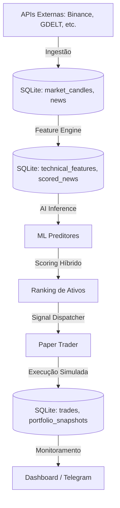
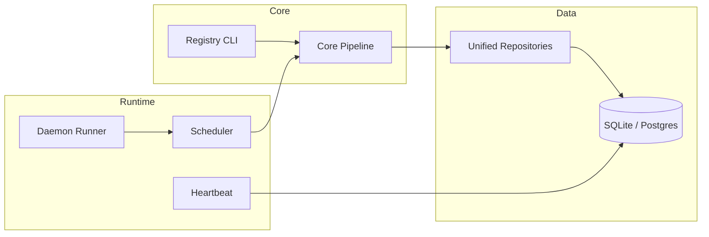

# 02_ARCHITECTURE_REAL - AlphaScope Audit

## 1. Arquitetura Implementada
O AlphaScope segue uma arquitetura modular de processamento de dados em camadas (*Layered Pipeline*), centrada em um banco de dados local (SQLite) que atua como barramento de estado compartilhado.

### Camadas:
1.  **Ingestão (Data Layer):** Busca candles (OHLCV) e notícias.
2.  **Processamento (Feature Layer):** Transforma dados brutos em indicadores técnicos e sentimentos.
3.  **Inteligência (AI Layer):** Treina modelos supervisionados e gera scores de ranking.
4.  **Operação (Strategy Layer):** Decide alocação e executa paper trading.
5.  **Automação (Runtime Layer):** Coordena ciclos contínuos via Daemon e Scheduler.
6.  **Observabilidade (Monitoring Layer):** Registra métricas, batimentos cardíacos (Heartbeat) e alertas.

## 2. Diagramas Mermaid

### Fluxo de Dados Operacional

### Arquitetura de Componentes

## 3. Diferenças: Documentação vs. Código
- **Documentação:** Cita PostgreSQL e Redis como infraestrutura padrão para produção.
- **Código Real:** A implementação utiliza maciçamente SQLite (`data/alphascope.db`) para persistência de dados e arquivos JSON/CSV/Parquet em `data/processed/` para metadados e datasets de pesquisa. O PostgreSQL está presente no código de infraestrutura, mas o CLI padrão opera localmente por simplicidade.
- **Diferença:** A documentação sugere uma separação clara entre "serviços", mas no código atual, quase tudo roda no mesmo processo Python (com exceção dos scaffolds em Go que são independentes).

## 4. Separação de Domínios
- **`src/alphascope/core/`**: Onde as orquestrações de alto nível acontecem.
- **`src/alphascope/automation/`**: Responsável pela vida útil do processo e automação cron-like.
- **`src/alphascope/ml/`** e **`src/alphascope/nlp/`**: Camadas de processamento inteligente desacopladas.
- **`src/alphascope/execution/`**: Onde as regras de trade e simulação residem.
